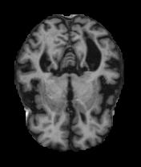
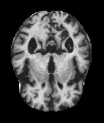
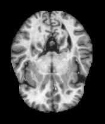
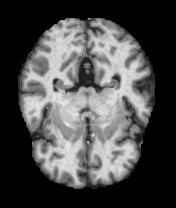

# DINOv2KAN: Kolmogorov-Arnold Network with DINOv2 Vision Transformer for Automatic Characterization of Alzheimer’s Disease

This repository contains the implementation and resources for **DINOv2-KAN**, a hybrid deep learning framework that combines the DINOv2 Vision Transformer (ViT) and Kolmogorov-Arnold Network (KAN) for MRI-based diagnosis of Alzheimer’s Disease (AD) with high accuracy.
**📄 Preprint:** [DINOv2KAN: Kolmogorov-Arnold Network with DINOv2 Vision Transformer for Automatic Characterization of Alzheimer’s Disease](https://drive.google.com/file/d/1qgTlVgdl5Rq9iRpXoARiZVxPcWpqTT_Q/view?usp=sharing)


## Overview

Alzheimer’s Disease (AD) is a progressive neurodegenerative disorder that affects memory and cognition. Early and precise diagnosis is crucial for effective treatment, but traditional approaches often fail to capture subtle changes at different disease stages.  The proposed method addresses these challenges.

This hybrid model is trained with **supervised contrastive learning** to further improve classification accuracy. Extensive experiments on the ADNI, OASIS, and Kaggle datasets demonstrate its superior performance, achieving:
- **99.11% ± 0.25% accuracy** for Alzheimer’s Disease vs. Non-Cognitively Impaired classification.
- **99.37% ± 0.40% accuracy** for a four-class classification (AD, Non-Cognitively Impaired, Early Mild Cognitive Impairment, Mild Cognitive Impairment) on the ADNI dataset.

These results, validated on additional datasets, show statistically significant improvements over state-of-the-art methods.

## Table of Contents

- [Introduction](#introduction)
- [Repository Structure](#repository-structure)
- [Competing Models](#competing-models)
- [Proposed Model](#proposed-model)
- [Getting Started](#getting-started)
- [MRI Image Samples - Kaggle Dataset](#mri-image-samples---kaggle-dataset)


## Introduction

Alzheimer's disease (AD) is a progressive neurodegenerative disorder that affects millions of individuals worldwide. Early detection and accurate diagnosis are crucial for effective intervention. This work explores various deep learning models to enhance the accuracy of Alzheimer’s disease prediction using medical imaging data.

## Repository Structure
```md
Alzheimer-disease-prediction/
├── MODELS/
│   └── COMPETING MODELS/
│       ├── Alznet.ipynb
│       ├── HTLML.ipynb
│       ├── Modified Alexnet.ipynb
│       ├── Modified Inception.ipynb
│       ├── Resnet18.ipynb
│       ├── Resnet50.ipynb
│       ├── VGG16.ipynb
│       ├── VGG19.ipynb
│       └── ViTBiLSTM.ipynb
├── PROPOSED MODEL/
│   └── DINOV2KAN_Inference.ipynb
    └── DINOV2KAN_Train.ipynb
    └── Sample Dataset/
        └── ADNI
        └── Kaggle
        └── OASIS
├── Splits/
│   ├── kaggledataset_split.csv
│   ├── oasisdataset_split.csv
│   └── adnidataset_split.csv


```
### Competing Models

The `COMPETING MODELS` folder includes various well-known deep learning architectures that have been utilized to predict Alzheimer’s disease. Each model is implemented in a Jupyter Notebook and can be executed independently.

| **Model**             | **Citation** |
|-----------------------|--------------|
| **AlzNET** | Gazala Mushtaq and K. Veningston. *Alznet: Computational clinical decision support for diagnosing Alzheimer’s disease from MRI images.* In **2023 International Conference on Next Generation Electronics (NEleX)**, pages 1–6. IEEE, 2023. |
| **HTLML** | Sarang Sharma, Sheifali Gupta, Deepali Gupta, Ayman Altameem, Abdul Khader Jilani Saudagar, Ramesh Chandra Poonia, and Soumya Ranjan Nayak. *HTLML: Hybrid AI based model for detection of Alzheimer’s disease.* *Diagnostics*, 12(8):1833, 2022. |
| **Modified AlexNet** | Heta Acharya, Rutvik Mehta, and Dheeraj Kumar Singh. *Alzheimer disease classification using transfer learning.* In **2021 5th International Conference on Computing Methodologies and Communication (ICCMC)**, pages 1503–1508. IEEE, 2021. |
| **Modified Inception** | Sarang Sharma, Sheifali Gupta, Deepali Gupta, Sapna Juneja, Amena Mahmoud, Shaker El-Sappagh, and Kyung-Sup Kwak. *Transfer learning-based modified Inception model for the diagnosis of Alzheimer’s disease.* *Frontiers in Computational Neuroscience*, 16:1000435, 2022. |
| **VGG-19** | Assmi Ayoub, Benba Achraf, and Jilbab Abdelilah. *Comparative classification of Alzheimer’s disease.* In **2024 IEEE 12th International Symposium on Signal, Image, Video and Communications (ISIVC)**, pages 1–6. IEEE, 2024. |
| **VGG-16** | Purwono Purwono, Alfian Ma’Arif, Iswanto Suwarno, Iis Setiawan Mangkunegara, Pramesti Dewi, and Endang Setyawati. *Comparison of the performance of CNN transfer learning in the classification of Alzheimer’s disease.* In **2023 International Conference on Information Technology Research and Innovation (ICITRI)**, pages 43–48. IEEE, 2023. |
| **ResNet-50** | M. Rajendiran, K.P. Sanal Kumar, and S. Anu H. Nair. *Detection of Alzheimer’s disease in MRI images using different transfer learning models and improving the classification accuracy.* *International Journal of Health Sciences*, 6(S3):11851–11869, 2022. |
| **ResNet-18** | Jayanthi Venkatraman Shanmugam, Baskar Duraisamy, Blessy Chittattukarakkaran Simon, and Preethi Bhaskaran. *Alzheimer’s disease classification using pre-trained deep networks.* *Biomedical Signal Processing and Control*, 71:103217, 2022. |
| **ViT-BiLSTM** | Taymaz Akan, Sait Alp, and Mohammad Alfrad Nobel Bhuiyan. *Vision transformers and Bi-LSTM for Alzheimer’s disease diagnosis from 3D MRI.* In **2023 Congress in Computer Science, Computer Engineering, & Applied Computing (CSCE)**, pages 530–535. IEEE, 2023. |


### Proposed Model

The `PROPOSED MODEL` folder features the **DINOv2-KAN** hybrid model, which combines vision transformers with Kolmogorov-Arnold Networks to enhance predictive performance. This notebook outlines the architecture, training process, and evaluation metrics.

## Getting Started

To get started with this repository:

1. **Clone the repository:**
   ```bash
    git clone https://github.com/lahirisoham2004/DINOv2-KAN.git
    cd DINOv2-KAN

2. **Install the required dependencies:** 
   Make sure you have Python and pip installed, then run:
   ```bash
    pip install -r requirements.txt
3. **Run the notebooks:** 

### Step 1: Training

Open `PROPOSED MODEL/DINOV2KAN_Train.ipynb`
Set your dataset path:
   ```python
   # Choose your dataset
   dataset_choice = "Kaggle"  # Options: "ADNI", "Kaggle", "OASIS"
   dataset_path = f"Sample Dataset/{dataset_choice}/"
```
Execute all cells to start training.
The model checkpoint will be automatically saved at:
```python
/kaggle/working/
├── fold_1_best_model.pth
├── fold_2_best_model.pth
├── ...
```
These files represent the best checkpoint (based on accuracy) for each fold.
### Step 2: Testing/Inference
Open `PROPOSED MODEL/DINOV2KAN_Inference.ipynb`
Set your test dataset path and checkpoint path:
```python
# Use same dataset as training
dataset_choice = "Kaggle"  # Must match your training dataset
test_dataset_path = f"Sample Dataset/{dataset_choice}/"
```
Load the trained model checkpoint
```python
checkpoint_path = "/kaggle/working/fold_1_best_model.pth"
```
Execute all cells to run inference.

### Configuration Details
1. Model Architecture Parameters
```python
# DinoV2KAN Model Configuration
model_config = {
    'num_classes': 3,
    'dino_model': 'facebook/dinov2-base',  # Options: 'facebook/dinov2-base' or 'facebook/dinov2-large'
    'freeze_dino': True,
    'kan_config': {
        'dim': 768,               # DINOv2 feature dimension
        'num_heads': 12,
        'hdim_kan': 768,
        'mlp_ratio': 4.0,
        'drop': 0.1,
        'attn_drop': 0.1,
        'drop_path': 0.1
    }
}
```
2. Training Hyperparameters
```python
# Training Configuration
training_config = {
    'batch_size': 16,
    'learning_rate': 1e-4,
    'weight_decay': 1e-5,
    'num_epochs': 100,
    'patience': 15,                      # Early stopping patience
    'optimizer': 'AdamW',
    'scheduler': 'CosineAnnealingLR',
    'loss_function': 'CrossEntropyLoss'
}
```
3. Data Preprocessing Parameters
```python
# Preprocessing Configuration
preprocess_config = {
    'target_size': (224, 224),
    'skull_strip_threshold': 0.1,
    'resample_spacing': (1, 1, 1),
    'num_middle_slices': 50,
    'normalize_method': 'rescale_intensity',
    'clip_threshold': 0
}
```
## MRI Image Samples - Kaggle Dataset

<p>
  
  
  
  
</p>

<p>
  <b>Mild Demented</b>&nbsp;&nbsp;&nbsp;&nbsp;&nbsp;
  <b>Moderate Demented</b>&nbsp;&nbsp;&nbsp;&nbsp;
  <b>Non Demented</b>&nbsp;&nbsp;&nbsp;&nbsp;&nbsp;
  <b>Very Mild Demented</b>
</p>


